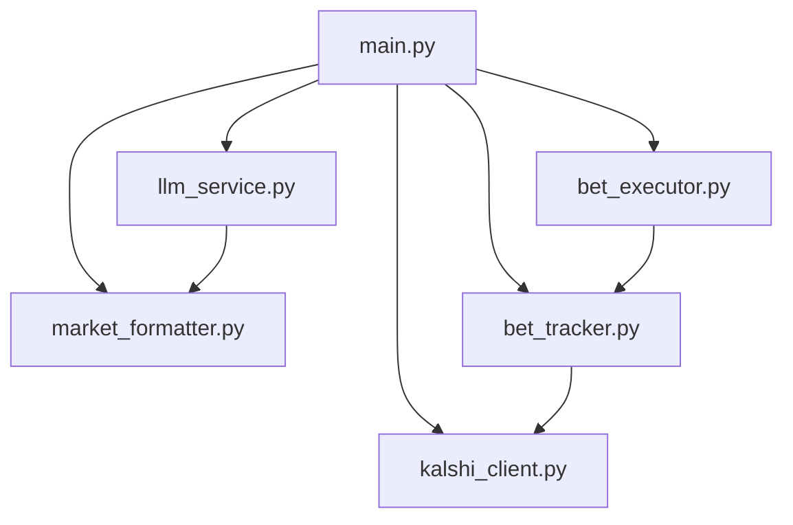

# Kalshi Analysis Bot

Automated analysis and trading tool for Kalshi prediction markets using Google's Gemini models.

## Features

*   **Smart Analysis**: Filters liquid markets (1-7 day expiry) to find high EV trades.
*   **LLM Integration**: Uses Google's Gemini models for probability estimation.
*   **Automated Trading**: Executes bets based on LLM confidence.

## Quick Start

1.  **Install dependencies**:
    ```bash
    pip install -r requirements.txt
    ```

2.  **Configure Environment** (`.env`):
    ```bash
    GEMINI_API_KEY="your_google_api_key"
    KALSHI_API_KEY_ID="your_kalshi_key_id"
    KALSHI_PRIVATE_KEY_PATH="/abspath/to/private_key.pem"
    SUPABASE_URL="your_supabase_url"
    SUPABASE_KEY="your_supabase_key"
    DRY_RUN=true # Set to false to enable real trading
    ```

## Automation (GitHub Actions)
Runs twice daily at **12:00 AM and 12:00 PM PST** via GitHub Actions.

### Setup
To enable the automation, you must add the following **Repository Secrets** in GitHub (Settings -> Secrets and variables -> Actions):

1.  `GEMINI_API_KEY`: Your Google Gemini API Key.
2.  `KALSHI_API_KEY_ID`: Your Kalshi Key ID (e.g., `kid-xxxxxxxx`).
3.  `KALSHI_PRIVATE_KEY`: The **entire contents** of your private key file.
4.  `SUPABASE_URL`: Your Supabase project URL.
5.  `SUPABASE_KEY`: Your Supabase anon/service key.
6.  `DRY_RUN` (optional): Set to `true` to test without placing real trades.

The workflow is defined in `.github/workflows/daily_analysis.yml`. You can manually trigger it from the "Actions" tab to test.

3.  **Run locally**:
    ```bash
    python3 src/main.py
    ```

## Structure

```
src/
├── main.py             # Entry point & orchestration
├── market_formatter.py # Market data formatting
├── llm_service.py      # Gemini API & prompt handling
├── bet_executor.py     # Trade execution
├── bet_tracker.py      # Supabase persistence
└── kalshi_client.py    # Kalshi API wrapper
```

## Call Stack


